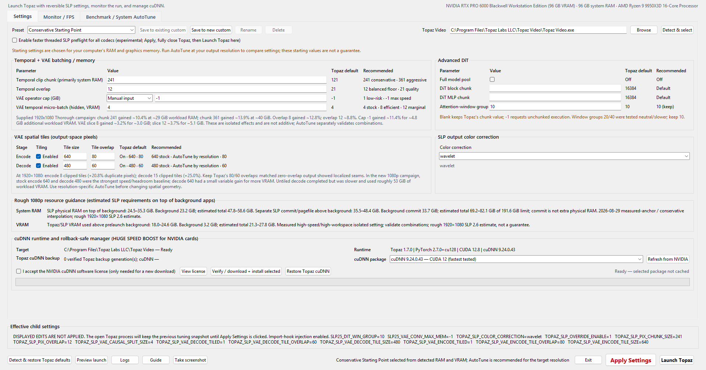
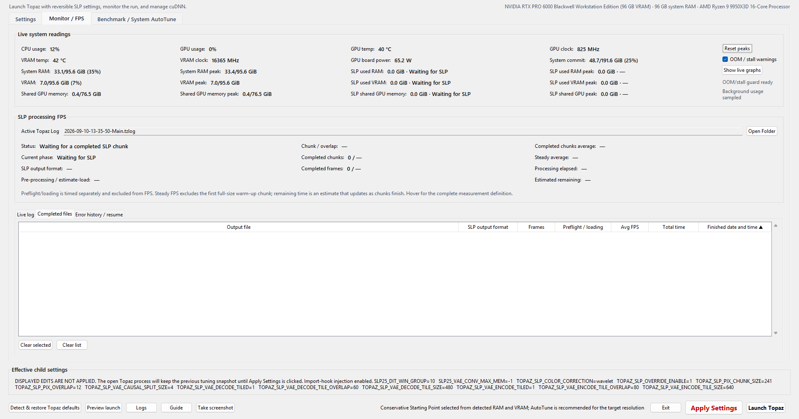
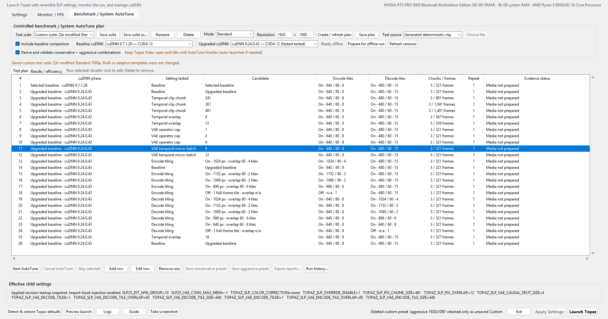
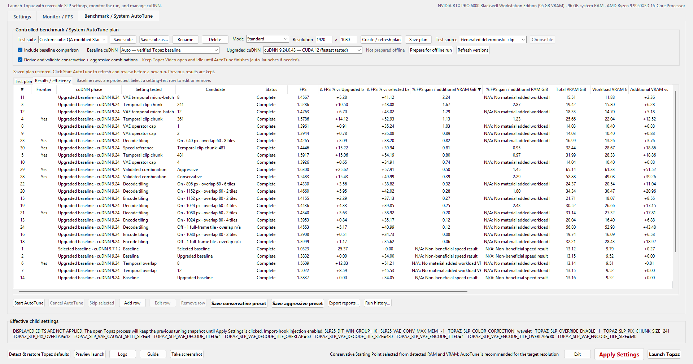
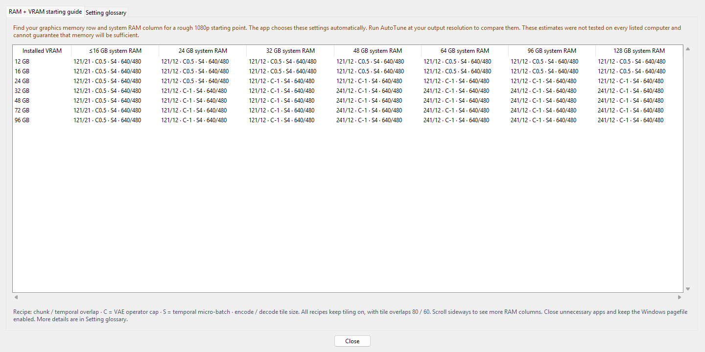

# Topaz SLP Tuning Launcher v1.0.2.2

After testing nearly every AI video enhancer I could get my hands on—including precision or traditional enhancement models such as Proteus, Iris, Rhea, UniFab, Aiarty, VikPea, and Nero, and generative or diffusion restorers such as SEEDVR2, FlashVSR, SLM, SLP, and LTX-2.5 LoRA—**Topaz SLP is, to my eyes, the undisputed king of quality**. Its weakness is speed. On my workstation SLP used to be slower than SEEDVR2, the project from which it descended, so I still chose SEEDVR2 for some less-important videos. With the speed increase I now get from this launcher, I personally have no reason to fall back to SEEDVR2 or another generative/diffusion restoration model. That conclusion describes my material, standards, and hardware; it is not a promise for every system.

I built Topaz SLP Tuning Launcher to make that exceptional restoration quality faster, safer to tune, easier to understand, and much more enjoyable to use. The single portable Windows executable launches Topaz Video with reversible, child-process-only SLP 2.6 settings; upgrades or restores cuDNN transactionally; watches SLP and whole-system memory; measures completed-chunk FPS; records completed and failed jobs; and can run a controlled, unattended Benchmark / System AutoTune campaign at the output resolution you actually use.

[Download the latest portable release](https://github.com/skv89/Topaz-SLP-Launcher/releases/latest) · [Report a problem](https://github.com/skv89/Topaz-SLP-Launcher/issues) · [Compare outputs with SKV89 Video Compare](https://github.com/skv89/SKV89s-Video-Compare-Tool/tree/main)

> [!WARNING]
> These controls target unsupported Topaz SLP internals. My measured hardware anchor is one NVIDIA RTX PRO 6000 Blackwell workstation with 96 GB VRAM and approximately 96 GB system RAM; other RAM/VRAM cells are conservative, evidence-bounded starting estimates rather than claims that those systems were tested. Always benchmark your own output resolution and test a short duplicate clip before unattended work. This independent community tool is not endorsed by Topaz Labs or NVIDIA.

> [!NOTE]
> The v1.0.2.2 executable is not Authenticode-signed, so Windows SmartScreen may show an unknown-publisher warning. Download it only from this repository and verify the published EXE SHA-256 before running it.

## Screenshots

> [!NOTE]
> These are the exact author-supplied v1.0.2 development-series captures. The v1.0.2.2 controls and layout remain substantially the same, but its title bar now reads **Topaz SLP Tuning Launcher v1.0.2.2**.

### Settings and cuDNN management

### Monitor / FPS and completed-file history

### Benchmark / System AutoTune plan

### Benchmark results and efficiency

### RAM + VRAM starting guide

## Quality: not a weaker-model speed trade

This launcher does not increase speed at the expense of output quality. It does not select a lower-quality model, lower model precision, reduce the requested output resolution, or skip SLP's restoration pass. It changes how the same SLP workload is divided across temporal chunks, temporal micro-batches, spatial tiles, and cuDNN kernels. On my tested material, the settings I kept increased speed and also produced a small quality improvement, at the cost of greater VRAM and system-RAM use.

I have spent nearly a year testing closely related controls in SEEDVR2. Larger spatial tiles—or disabling tiling when memory permits—create fewer artificial tile boundaries. That can preserve more surrounding image context and reduce the number of overlapping border regions that must be cropped, blended, or stitched. In my SEEDVR2 comparisons, reducing and sometimes eliminating encode/decode tile overlap made fine detail cleaner. This is not a universal rule: too little overlap can reveal seams, and this project's SLP testing found visible localized seams in both zero-temporal-overlap and zero-spatial-overlap tests. Treat spatial overlap, temporal overlap, and tiling as different controls and verify the exact combination on representative content.

Larger temporal chunks and batches can also reduce the number of temporal boundaries and state resets across a video. The potential benefit is steadier motion, less jitter, and better continuity—not merely a sharper still frame. A static frame comparison cannot prove that change. Use modes 2, 3, or 4 in the [SKV89 Video Compare Tool](https://github.com/skv89/SKV89s-Video-Compare-Tool/tree/main) to play the original and tuned outputs side by side and judge motion with your own eyes.

Larger or disabled spatial tiles can be slower at some output resolutions while consuming much more memory. If you have substantial unused headroom—especially 48 GB VRAM or more—you may still choose to test them for quality even when they are not the fastest result. Topaz already begins SLP at a relatively large temporal chunk of 121, so I do not expect the improvement over stock SLP to be as visually dramatic as the differences I observed while tuning SEEDVR2.

## Start

1. Download `Topaz-SLP-Launcher.exe` from the Releases page to a writable folder.
2. Double-click `Topaz-SLP-Launcher.exe`. The filename remains stable across updates so an existing shortcut can continue to work; the GUI title bar shows **Topaz SLP Tuning Launcher v1.0.2.2**.
3. Start with the immutable **Conservative Starting Point**, which selects a conservative rough 1080p recipe from both detected physical RAM and VRAM. A system with 16 GiB RAM or less now receives the exact known native SLP floor—121/21 temporal settings, 0.5 GiB cap, slice 4, and tiled 640/480 geometry—instead of being rounded up to the 24 GiB-RAM tier. Even native SLP is not guaranteed to fit once Windows, Topaz, source decoding, and background applications share that small physical pool; keep a system-managed pagefile enabled and close unnecessary applications. Run **Benchmark / System AutoTune** at the output resolutions you actually use for hardware- and resolution-specific settings. Select immutable **Stock Topaz** for a no-override run, or use **Detect & restore Topaz defaults** to load a complete verified native snapshot when one has been captured for the exact current Topaz executable and SLP module.
4. Click **Launch Topaz**, then configure and start the SLP export normally in Topaz. Editing settings while Topaz is open enables **Apply Settings**; pressing it changes only SLP files whose runners start afterward, never the file already processing.

The title-bar **X hides the launcher in the Windows notification area and removes its taskbar button**, so monitoring can continue without a taskbar window. Double-click the notification-area icon to restore the launcher. Right-click that icon and choose **Exit** to close it, or use the in-app **Exit** button. If Windows has placed the icon in the notification-area overflow menu, open the small up-arrow beside the taskbar clock.

The first launch after replacing an older copy at the same stable executable path performs a one-time Windows Shell icon refresh. This corrects Explorer if it retained the prior file icon; later launches of that unchanged build skip the refresh.

The download is genuinely standalone: the child-process hook and third-party notices are embedded, and the same executable hosts the optional isolated VRAM-temperature poll. At startup the launcher validates and materializes its runtime beneath `Topaz-SLP-Launcher-Data` beside the EXE; no preinstalled sidecar file is required. Put the EXE in a folder where the current user can write. Settings are applied only to the Topaz child process; no permanent system environment variable is created.

## Temporal control

**Temporal clip chunk (primarily system RAM, but also VRAM)** is Topaz's outer frame window and behaves more like SEEDVR2 chunk size than GPU temporal batch size. In the supplied three-repetition 1920×1080 campaign—with required idle Topaz, stock 640/480 spatial tiles, cuDNN 9.24 CUDA 12, and bracketing controls—chunks 201/241/361/481 measured median gains of approximately **+8.26/+10.36/+13.87/+15.38%**. Chunk 201 nevertheless reached 51.37 GiB total RAM and **16.24 GiB total VRAM** on the test host, so it is a useful diagnostic rather than a safe 16 GiB-card default. Chunk 241 used about 29.0 GiB workload physical RAM / 15.8 GiB workload VRAM after removing the immediate idle background, while chunk 361 used about 39.7 GiB / 22.1 GiB. Relative to the Upgraded baseline, chunk 201 and 241 added about **4.2 GiB and 6.3 GiB workload VRAM**, proving the temporal setting is not RAM-only. A separate later guarded chunk-481 trial measured only **+0.20%** while reaching 66.80 GiB total RAM and 31.17 GiB total VRAM. That cross-run disagreement reinforces that chunk speed is not monotonic and must be measured under the current geometry and machine state; 481 remains a high-end capacity diagnostic, not a fixed recommendation. Fixed 16/24 GiB VRAM starting presets therefore remain at stock chunk 121; the adaptive suite adds guarded chunk 161 as a lower-memory bridge users can measure. The extra speed is neither free nor linear; Conservative Starting Point and the built-in benchmark gate temporal chunks by physical RAM, VRAM, and requested resolution.

Resolution matters. In the supplied 1440×1080 Standard run, chunk 201/241/361/481 measured **−9.43/−7.76/−4.40/−2.46%** versus the Upgraded baseline, while overlap 8/12 measured **−5.28/−8.38%**. Those rows are retained as valid evidence rather than corrected away: tensor geometry can change cuDNN engine/workspace selection and memory locality. Standard measures each candidate once after discarding its first warm-up chunk, so Thorough is the appropriate confirmation for a surprising resolution-specific result.

**Temporal overlap** shares frames between adjacent outer clips. Conservative Starting Point uses a conservative value from its RAM×VRAM matrix; the 1920×1080 campaign found 8 speed-oriented and 12 balanced, while 21 remains Topaz's maximum-continuity baseline. Conservative AutoTune never recommends below 12; Aggressive may select 8 only on GPUs with 32 GiB VRAM or less, and still must validate the combined preset. Reduced overlap trades temporal context for less repeated work, so compare a representative short clip before committing to a long render. Zero overlap was a repeat-validated special case: it improved unique-frame throughput by roughly 10% but produced visible localized seams and consumed about 4.6 GiB more physical RAM and private commit.

**VAE temporal micro-batch (hidden, primarily VRAM)** is the separate inner GPU temporal control that was previously hidden in Topaz's model YAML as causal `split_size: 4`. It is not the outer clip. The launcher accepts only the measured values 4, 8, and 12. Against the stock split-4 control, split 8 gained a matched median **3.25%** for about 3.0 GiB more workload VRAM and 2.6 GiB more workload commit; split 12 gained **3.68%** for about 5.1 GiB more VRAM and 5.3 GiB more commit. Split 8 is the more efficient measured step, while 12 buys only a small additional gain. Do not combine either with an unlimited operator cap unless that exact combination has passed its own short validation, because cuDNN workspace interactions can be nonlinear.

Split 8 is not bit-identical to split 4, but the 1,000-frame comparison was very close: PSNR 56.02 dB and SSIM 0.998877. Per-frame differences did not spike at the new eight-frame boundaries, and the numerical difference was slightly smaller than the measured difference caused by changing native cuDNN to 9.24. It remains an unsupported experimental control: validate representative content before unattended production use.

## Topaz defaults and tested recommendation

The page tabs sit above the controls; the preset selector and Topaz path are part of the unified **Settings** tab. The tab shows the stock value and tested recommendation beside every editable control. Long explanations use the available horizontal width and rewrap when the window narrows. Blank DiT chunk fields mean “keep Topaz's profile value.”

The two built-in launch presets are immutable. **Conservative Starting Point** uses both detected physical RAM and VRAM to select one cell from the 1080p starting matrix shown in the Guide. **Stock Topaz** supplies no SLP tuning override and displays Topaz's own values. Edited fields display the nonselectable state **Unsaved edits**. Up to 20 named custom presets can be created with **Save to new custom**, overwritten with **Save to existing custom**, renamed, and deleted. AutoTune's separately executed conservative and aggressive combinations can also be saved as ordinary custom presets named for the tested resolution.

## Applying settings

The launcher keeps an atomic applied-settings snapshot. **Apply Settings** is gray and unavailable while the controls match that snapshot; it becomes larger, bold red, and clickable after any launch setting changes, including the faster-threaded-preflight checkbox. Applying writes a new revision for subsequent SLP runs, including files already waiting in Topaz Video's export queue. A file that is already processing retains the settings captured when its SLP run began. Ordinary SLP-parameter changes need only **Apply Settings**, but Apply alone is not enough for the threaded-preflight option because its hook is selected when Topaz starts: click **Apply Settings**, fully close Topaz Video, and then click **Launch Topaz** in the tuner. **Launch Topaz** automatically applies the currently displayed settings before starting Topaz and reports success in the status line instead of showing routine confirmation dialogs. Its existing-process check uses Windows' native process snapshot rather than the external `tasklist.exe` command, so a transient `tasklist` stall cannot abort an otherwise valid launch.

**Detect & restore Topaz defaults** first accepts a complete pre-override native snapshot whose Topaz executable and SLP-module sizes and SHA-256 hashes still match. It can also restore the verified factory values before Topaz starts when the installed SLP module exactly matches a known size and SHA-256 profile; this identity is independent of the installed cuDNN DLLs, so a user-replaced cuDNN cannot be mistaken for proof of native SLP settings. On success it loads the detected display values with no SLP tuning overrides and disables faster threaded preflight; click **Apply Settings** to commit the change. If the selected runner has no cached native snapshot yet, the warning explains that Topaz must be launched through the tuner and an SLP 2.6 export started so the hook can capture and cache the pre-override values. Selecting Stock Topaz manually supplies no tuning overrides but does not change the separate threaded-preflight preference. Neither action restores, uninstalls, or otherwise changes cuDNN; use **Restore Topaz cuDNN** for those DLLs.

**Restore Topaz cuDNN** is an exact rollback, not a version-label toggle. It selects the verified backup bound to the selected `Topaz Video.exe`, restores precisely that saved DLL set, removes components found only in the upgraded package, and independently rechecks every active file's size and SHA-256 hash plus the Topaz version, executable identity, backup-manifest hash, and fresh per-operation evidence. It also accepts an idempotent repair when the version label was already Topaz's but a file needed replacement. Topaz and neuroserver must be closed, and Topaz must be relaunched afterward before comparing speed. A matching older portable backup is imported into executable-adjacent storage without deleting the original; if an exact-executable Topaz backup already exists, a differing active/upgraded DLL set reuses that verified generation and can never be captured as a new “Topaz” backup. If the backup is missing or corrupt, supported Topaz Video 1.7 builds can use built-in recovery only when every pinned recovery identity check matches; otherwise it stops without guessing.

### v1.0.1 memory-regression safeguard

The v1.0.0 and v1.0.1 starting presets were selected from installed VRAM alone; they did not account for system RAM. v1.0.1 also made several recipes more aggressive than v1.0.0—for example, its 48 GB-VRAM recipe moved from a 241/21 tiled path to 361/12 with untiled encode. Users with ample VRAM but insufficient RAM or Windows commit headroom could therefore encounter severe paging or OOM conditions. v1.0.2 replaces that one-dimensional choice with a conservative RAM×VRAM starting matrix. Its explicit 16 GiB-or-less RAM tier leaves every exposed SLP value at the known native floor rather than silently treating an undersized or unknown host as a 24 GiB system.

A separate, proven v1.0.1 migration defect could refresh a serialized built-in preset from its name during startup, so the same visible preset name could launch materially different RAM/VRAM settings after an update. v1.0.2 never silently replaces a differing saved recipe this way. It preserves the exact older values in a named custom slot, or as unsaved edits if all 20 slots are occupied. These safeguards improve the starting point, but they do not make a generic matrix hardware- or resolution-specific. Run at least a **Standard** AutoTune at every output resolution you regularly use: a setting that gains speed at one tensor geometry can be neutral or slower at another, as the VAE encode/decode tiling results demonstrate.

## Optional automatic threaded SLP preflight

The installed SLP 2.6 `LazyVideoReader` performs an exact decoded-frame count by calling `ffprobe -count_frames` without decoder threading. The opt-in **faster threaded SLP preflight** hook replaces only that process-local Python callable and adds `-threads auto` to the same exact count. It applies automatically to every SLP source codec launched through this application; there is no remux, prepared copy, or manual re-import. It does not edit or replace Topaz/FFmpeg files, and it falls back to the native count if the threaded probe fails. The checkbox choice remains saved across tuner launches, but it does not permanently patch Topaz or Windows and is active only in Topaz sessions launched through the tuner while selected. Once the tuner has launched Topaz, it does not need to remain running for either the applied SLP settings or this hook during that Topaz session; closing it stops live Monitor/FPS readings and OOM/stall warnings. Every later Topaz session must also be launched through the tuner, reopening the tuner first if it was closed.

v1.0.2.2 also makes FFprobe discovery portable across machines. The launcher prefers a complete independent FFmpeg/FFprobe pair when one is installed, but falls back to the complete pair bundled beside the selected Topaz Video executable when the user has no separate FFmpeg installation. It gives the process-local hook the exact selected FFprobe path and places that pair's directory first only on the affected child process's `PATH`, so Topaz's compiled native fallback can resolve `ffprobe` as well. This prevents the all-row `WinError 2` / neuroserver code-7 failure seen on machines whose system `PATH` had no FFprobe, without changing the global Windows environment or any Topaz file.

The installed function's exact unthreaded command was captured from the compiled SLP module. On the 804-frame FFV1 test file, the process-local threaded path returned the same 804 frames in 6.632 seconds; the equivalent unthreaded count was roughly 80 seconds. Other codecs use the same hook but had much smaller baseline count times. The earlier “full decode to null” comparison was diagnostic evidence, not a Topaz command-line switch. This option accelerates the SLP runner's frame-count preflight, not Topaz GUI import or model loading. After changing it, click **Apply Settings**, fully close Topaz Video, and use **Launch Topaz** in the tuner.

## OOM/stall guard and diagnostic live log

During ordinary Topaz-driven SLP processing, the Monitor/FPS page watches physical RAM, Windows commit headroom, dedicated VRAM headroom, and completed-chunk/phase progress whenever **OOM / stall warnings** is enabled (it is enabled by default). A warning needs two consecutive pressure samples: at least 90% full or no more than 4 GiB physical-RAM, 8 GiB commit, or 2 GiB VRAM headroom; 97% full is critical. No completed-chunk/phase progress also warns after 10 minutes under memory pressure or 20 minutes otherwise, with a 15-minute per-run alert cooldown. Log phases are reconciled with the live process list: if no `neuroserver.exe` remains, an unfinished historical runner is shown as stopped, its completed progress is retained, its ETA and live identity are cleared, and the guard returns to ready instead of continuing to report stale VAE decode activity.

The launcher cannot recover allocations that have already failed and does not silently change a running job's settings. A resource warning is not proof that Topaz has already OOMed. When the injected runtime audit exposes the exact active worker PID, the dialog offers three explicit choices: **Yes** verifies that PID is still `neuroserver.exe` and terminates only that process tree—which necessarily makes the current Topaz export fail—**No** continues and mutes later warnings for this runner, and **Cancel** continues monitoring. **No is the safe default.** If the PID cannot be verified, the launcher warns but refuses to terminate anything. It never kills a process automatically and never terminates `Topaz Video.exe`. An export that exits or crashes is retained in Error history when Topaz's logs provide enough evidence. A job that remains slow but continues making phase/chunk progress without reaching a pressure threshold shows its low FPS normally; that condition alone is not treated as OOM.

The **Live log** subtab shows a bounded 10 MiB on-screen history backed by five rotating 10 MiB JSONL archives. It records launcher actions, applied revisions, active runner IDs/PIDs, parsed lifecycle state, failures, resource alerts, and user responses. Windows profile paths are redacted in diagnostic output. Clear screen affects only the on-screen tail; exporting combines the disk archive, while deleting saved logs is a separate explicit action. Diagnostic logs never replace or clear completed/error history. A slow chunk or a long period without a log update is not treated as a new export; only an actual later SLP runner-start event can reset the active run's chunk/FPS accumulator.

## Error history / resume

Evidence-backed nonzero exits, OOM markers, and interrupted SLP runners are retained in a separate **Error history / resume** subtab with source, reason, completed progress, partial-output path, and captured applied-settings revision when available. Right-clicking can select either file in Explorer, load the captured settings, or **Retry from beginning**.

Exact mid-file continuation is intentionally disabled. Controlled frame-boundary continuation tests changed pixels at SLP overlap boundaries, and Topaz does not expose a supported job-reconstruction API. The safe recovery therefore restarts the original source under the captured settings; it does not delete the failed record or partial output and does not pretend a frame-0 retry is an exact resume.

## Benchmark / System AutoTune

The Benchmark tab builds a controlled one-factor-at-a-time plan and prepares one hashed, exact-frame deterministic or user-sourced trial clip. A read-only dropdown makes the active source type explicit. Quick runs one full chunk only as a preliminary peak-memory/OOM screen: its one chunk contains startup warm-up, so speed is low-confidence, and a short observed peak cannot certify long-run memory safety. Quick never creates combined presets. A separate two-chunk mode is intentionally omitted because it still cannot discard warm-up and retain two steady chunks. Standard is the shortest defensible speed comparison: it runs three full chunks and excludes the first warm-up chunk from steady speed. Thorough repeats that same three-chunk measurement three times in randomized order to reveal variation and order effects. Source length accounts for overlap: `C + (N-1) × (C-overlap)`, so three 121/21 chunks require 321 unique source frames—not 363.

Run at least **Standard** at each output resolution you actually deliver; use Thorough to confirm surprising or close results. Before benchmarking, close unnecessary background applications. After **Prepare for offline run** reports that both runtimes are ready, disconnecting from the internet can reduce background traffic and update activity. Leave the computer otherwise idle: even light work such as typing a document or browsing ordinary web pages can measurably lower FPS. Long suites should also start from a thermally stable system with adequate ventilation; open a window or use air conditioning when appropriate so heat soak does not reduce CPU, GPU, or system-wide performance midway through the campaign.

**Start AutoTune** reconstructs and submits every bounded SLP job directly to the installed `neuroserver.exe`; no Topaz import, export-queue action, or per-row user intervention is required. Topaz Video is a mandatory footprint control: if it is not already open, the launcher starts it automatically, then requires that same GUI process to remain open and idle throughout the campaign. Do not use or close Topaz while AutoTune runs. AutoTune refuses to collide with any existing neuroserver, invalidates a row if the required Topaz process disappears or restarts, supports exact-PID cancellation, verifies output integrity, and positively verifies the requested cuDNN inside every child. Native and Upgraded baseline rows observe RAM, commit, dedicated VRAM, shared-GPU spill, and forward progress without imposing launcher-added memory floors while the worker is advancing; this lets a baseline behave like ordinary Topaz instead of being aborted only because it uses nearly all dedicated VRAM. Experimental rows retain proactive guards. The former 4 GiB physical-RAM buffer is reduced to 1 GiB on systems through 24 GiB and 2 GiB above 24 GiB; Windows commit separately retains 8 GiB. AutoTune no longer reserves a fixed amount or percentage of dedicated VRAM. Its 0.3 GiB through 16 GiB, 0.5 GiB through 24 GiB, 1 GiB through 32 GiB, and 4 GiB above 32 GiB tier values only arm sustained process-attributed shared-memory spill detection near the device limit; a low free-VRAM sample alone does not fail a row. A baseline can still stop on a real worker failure, cancellation, timeout, Topaz lifecycle violation, or sustained memory spill accompanied by a severe progress collapse.

The Benchmark tab has separate **Baseline cuDNN** and **Upgraded cuDNN** selectors. The Upgraded selector defaults to the proven CUDA 12 cuDNN 9.24.0.43 package; **Refresh versions** obtains other NVIDIA packages compatible with the selected Topaz CUDA major. **Auto — verified Topaz native** is used only when exact built-in executable and SHA-256 provenance proves the installed runtime is native. The launcher never assumes that an installed runtime is native because users may already have replaced those DLLs. When native provenance cannot be proved, the selector defaults to the explicit compatible 9.7.1.26 NVIDIA package when available and labels it **Selected baseline**, not Topaz baseline; the user can choose another compatible comparison version.

**Prepare for offline run** downloads every missing selected package, verifies NVIDIA metadata and SHA-256, extracts both runtimes into executable-adjacent storage, and validates the child-local manifests before any benchmark trial begins. When it reports **Ready for offline benchmark**, the user may disconnect from the internet. Start AutoTune repeats local integrity checks but performs no network cuDNN lookup, installed-DLL swap, restore, UAC prompt, or per-row license prompt.

The NVIDIA license checkbox is required only before the first NVIDIA download. A package that was previously accepted, downloaded, and hash-verified can be reused while the box is unchecked; this is why an AutoTune run can legitimately start without a newly checked box. It is not automatic license acceptance. Once **Start AutoTune** passes its preparation gate, the run is unattended: there are no per-row license dialogs, installs, restore prompts, or UAC prompts.

Ordinary rows retain a Topaz 121/21, cap-0.5, slice-4 baseline and change exactly one named control. Built-in temporal candidates are admitted by detected RAM, VRAM, and requested resolution, then run from smallest to largest. When both installed RAM and VRAM are above the 32 GiB tier, the built-in suite omits bridge chunks 161 and 201 and begins with larger admitted candidates; custom suites can still retain either bridge. If a temporal row reaches a RAM/commit headroom floor, produces sustained process-attributed shared-memory spill, or reports an explicit OOM/allocation failure, the same and larger remaining temporal rows are recorded as **capacity skipped** without invented FPS evidence; unrelated rows and controls continue. During AutoTune these expected capacity events are logged in the row instead of opening a modal dialog. Named custom suites can still request any valid chunk for an intentional guarded test. Their existing rows are preserved when Add row is used; double-click edits a plan row, right-click offers edit/insert-above/insert-below, the keyboard **Delete** key removes the selected custom row, and dragging changes the persisted suite order. The Mode dropdown's **cuDNN only test** option ignores saved tuning rows and creates exactly two Standard-length Topaz-default rows: the selected native/baseline cuDNN and the Upgraded baseline. Removing every custom row creates the same narrow comparison. Recommendation derivation is disabled because there are no tuned candidates. Successfully measured, warning-free custom rows participate in the same conservative/aggressive recommendation pool as built-in evidence, provided at least three independent setting families complete. Encode/decode comparisons retain Topaz's 80/60 overlaps and choose a small resolution-aware set around material clipped-tile transitions—approximately 2, 4, 6, and 8 tiles—rather than enumerating every tile size. One tile is one clipped overlapping spatial-operator invocation. Guarded untiled decode is included only at 72 GiB VRAM or more and at no more than 1920×1080 pixels. After isolated rows finish, measured headroom and performance construct conservative and aggressive combinations; those exact combinations are then executed separately before their save buttons become available and bold.

Export creates a landscape PDF with readable tables and charts for speed gain versus both applicable baselines, total RAM/VRAM, background-removed workload RAM/VRAM, resource deltas, and the observed speed/resource frontier. “Workload RAM/VRAM” means peak whole-system use during SLP minus the immediate idle pre-run background; it is not the Monitor tab's process-attributed SLP-used reading. Separate ranking tables show `% gain per additional GiB of workload RAM` and `% gain per additional GiB of workload VRAM`; deltas below the telemetry materiality threshold are labeled **No-add** instead of dividing by noise. The full-width evidence table includes tile state, size, overlap, exact tile count, repeated-run number, and a Pareto-frontier marker. JSON and CSV raw evidence plus a Markdown summary are written alongside the PDF. Manual export names all four files after the selected report-bundle folder. Report footnotes explain the repetition medians and same-repetition bracketing used for drift control. **Export PDF + data Reports** proposes a dated suite-based bundle name beside the EXE on first use and remembers the last chosen parent folder. One-factor gains and memory deltas are not additive: cuDNN algorithm choice, allocation lifetimes, temporal batching, and spatial tiling can interact nonlinearly, which is why combined recommendations require their own validation runs.

The Benchmark workspace has separate **Test plan** and **Results / efficiency** subtabs. Results mirrors the report evidence and efficiency fields, updates as trials finish, and supports ascending/descending sorting from every column header. Its default view ranks the highest valid `% FPS gain per additional GiB of workload VRAM` first. A positive speed row with no material additional VRAM is labeled instead of being assigned an artificial infinite score, and zero/negative-speed or unavailable rows follow the genuinely comparable rankings. Custom Test-plan rows can be edited by double-click, reordered by drag/release, or edited/inserted/removed from the right-click menu.

## Output color correction

The color-correction dropdown exposes the six modes implemented by the installed SLP runner: `lab`, `wavelet`, `wavelet_adaptive`, `hsv`, `adain`, and `none`. Topaz defaults to `wavelet`. Hover over the control for the full mode descriptions. The compact Settings page intentionally omits a duplicate always-visible explanation. Color modes can materially change the picture, so compare short representative clips before a long export.

| Control | Topaz default | Tested recommendation |
|---|---:|---:|
| Temporal clip chunk | 121 | Conservative Starting Point never goes below 121 and uses 241 only at 48+ GiB RAM with 32+ GiB VRAM; chunk 361 is reserved for a validated aggressive/custom result |
| Temporal overlap | 21 | The 16 GiB-or-less RAM tier keeps native 21; other starting cells use the measured balanced floor 12; 8 is an aggressive candidate on ≤32 GiB VRAM only |
| VAE operator-memory cap | 0.5 GiB | The 16 GiB-or-less RAM tier keeps native 0.5; `-1` is a measured high-speed/high-risk candidate gated to systems with more host RAM and sufficient VRAM |
| VAE temporal micro-batch | 4 | Conservative Starting Point keeps native 4 in every cell; 8 is an efficient measured AutoTune candidate and 12 is marginal, but either needs separate validation with the chosen operator cap |
| Encode tiling / tile / overlap | On / 640 / 80 | Retain stock unless resolution-specific AutoTune proves otherwise |
| Decode tiling / tile / overlap | On / 480 / 60 | Retain stock; 640 is a small, variable AutoTune candidate on the test system |
| Full DiT pool | Off | Off |
| DiT attention-window group | 10 | 10 |
| DiT block / MLP chunk | 16384 / 16384 | Keep Topaz default |

Encode and decode tile overlap are exposed by Topaz and editable in the launcher. Keep them at 80 and 60, respectively, unless deliberately testing; nondefault overlap can change redundant work and boundary blending. The Settings tab dynamically shows the exact number of clipped VAE tiles and duplicate-pixel overhead for a 1920×1080 frame, making overlap thresholds visible before launch.

In resource/performance screening, encode overlap 0/40 reduced encode time versus 80, while 400/800 crossed extra-call thresholds and became much slower. Decode overlap 0/32 reduced decode time versus 60, while 160/640 crossed six/eight-call thresholds and became much slower. RAM, commit, and VRAM were essentially unchanged across these rows. A later all-frame and seam-focused comparison found localized vertical/horizontal discontinuities with zero spatial overlap, so keep Topaz's 80/60 defaults for normal work.

Topaz also exposes `SLP25_DIT_WIN_GROUP`, which groups attention windows for QKV projection rather than batching video frames. Values 20 and 40 were tested against the default 10 and were 0.17% slower overall; keep 10. No additional hidden frame-temporal DiT `batch_size` was found.

## System RAM and commit guidance

The launcher reports two different host-memory capacities because Windows does not keep all of neuroserver's allocation resident at once:

- **SLP physical RAM on top of background** is the measured increase in system physical usage after subtracting a quiet prelaunch baseline. The live monitor samples the user's current background RAM while Topaz is closed and adds it only to this physical range.
- **SLP commit/pagefile reservation** is the separate private/system commit range needed by the process. It can be much larger than resident physical RAM and must not be added again as though it were another physical allocation. While Topaz is closed, the monitor also captures current background commit and the Windows commit limit so the launcher can show an estimated total commit range.

The 2026-08-29 campaign's stock 121, 241, and 361 chunk rows measured medians of about 21.9/29.0/39.7 GiB workload physical RAM and 29.5/35.7/44.0 GiB workload commit after removing the immediate idle background. That stock measurement alone exceeds a 16 GiB host's entire physical capacity, so no launcher preset can promise that native SLP will fit there. The explicit 16 GiB-or-less column is therefore a no-added-tuning fail-safe, not an OOM guarantee. Keep a Windows system-managed pagefile enabled, close unnecessary applications, and treat sustained paging as a sign that the workload exceeds comfortable physical capacity. Physical residency can move non-monotonically as Windows trims working sets, while commit is a cleaner capacity trend. The GUI therefore uses conservative bounded interpolation, not a false-precision linear equation.

The earlier b3 validation gate measured a historical 241/12 combination with a **1 GiB operator cap**, slice 8, and 640/480 tiles at a median **+24.17% matched FPS**, 29.14 GiB workload physical RAM, 36.15 GiB workload commit, and 15.80 GiB workload VRAM. The exact aggressive 361/8, unlimited-cap, slice-4, 640/640 combination measured **+36.29%**, 36.24 GiB physical RAM, 52.67 GiB commit, and 25.17 GiB VRAM. Those measurements remain non-additive evidence anchors; b6 does not present the historical 241/cap-1/slice-8 combination as its current default. Current hardware cells and all other combined settings remain estimates until measured by AutoTune.

## VRAM guidance

The displayed **Topaz/SLP VRAM used above prelaunch background** is estimated from `peak total VRAM - prelaunch background VRAM`, so background applications are not attributed to Topaz. It is not VRAM added on top of the stock requirement. When Topaz is closed, the live monitor updates the user's current background allocation and separately displays the estimated total.

The RAM and VRAM estimates are deliberately broad and calibrated only for Topaz Video 1.7 with SLP 2.6, 1920×1080, scale 1, and the benchmarked 96 GB NVIDIA GPU. They are not safety guarantees. Guarded untiled 1080p VAE decode completed in the new campaign, but its roughly 53 GiB workload VRAM demand and slower speed make it a diagnostic row rather than a recommendation; keep decode tiling enabled.

The new isolated rows make the tradeoffs clearer. Stock chunk 121 used about 9.5 GiB workload VRAM; chunk 241 used 15.8 GiB and chunk 361 used 22.1 GiB. Positive operator caps 1/2/4/8 clustered near a 0.9 GiB VRAM increase for only about 1.2-1.4% matched speed gain, while `-1` added about 4.8 GiB and gained 11.43%. Split 8/12 added about 3.0/5.1 GiB and gained 3.25/3.68%. Larger spatial tiles were generally slower and heavier than stock 640/480. Guarded untiled decode completed but was about 2.28% slower and used roughly 53.0 GiB workload VRAM / 74.2 GiB workload commit, so it is not promoted.

## Guide and setting help

Hover over tuning labels or input fields for a plain-language explanation. The **Guide** button immediately after **Logs** opens a setting glossary and the complete 12/16/24/32/48/72/96 GiB VRAM by 16-or-less/24/32/48/64/96/128 GiB system-RAM conservative-start matrix. The adjacent **Take screenshot** button first maximizes the launcher, waits for the window to finish drawing, captures the complete launcher—including its title bar, header, current tab, and footer, but not unrelated desktop windows—and copies it as a bitmap. When asking for help or sharing results, open the relevant tab, click **Take screenshot**, and press **Ctrl+V** in your forum reply. Include every relevant settings, Monitor/FPS, and AutoTune-results view; without that evidence, the report cannot be meaningfully diagnosed and offers little help to the community. Both buttons stay in the same shared footer on every primary tab. Only this 96 GiB VRAM / approximately 96 GiB RAM workstation is a measured hardware anchor; every capacity cell is explicitly labeled as a performance-oriented extrapolation rather than a result measured on that hardware pairing. The 16 GiB-or-less column is the exact known native SLP floor, not a claim that stock SLP fits in 16 GiB physical RAM. Use the live estimated total (including background usage), preserve headroom, test a short duplicate clip, and run AutoTune at the output resolutions you actually use. cuDNN 9.24.0.43 for CUDA 12 is the fastest package verified by this project; CUDA 13 catalog entries are not performance recommendations.

## Average FPS

SLP FPS monitoring is always on while the launcher is running. Every poll selects the most recently modified Topaz log so monitoring automatically moves to later Topaz sessions and exports. The read-only **Active log** field shows which file is currently being monitored; earlier results remain available in the persistent completed-files table. While processing is active, **Completed-chunk average** uses unique frames and elapsed wall time beginning at the first SLP `Phase 1: VAE Encode` and ending at the latest completed decode; the caption changes to **Completed-run average** only after the run finishes. **Steady average** additionally excludes the first full-size warm-up chunk. This avoids Topaz's misleading instantaneous jumps between very low and very high FPS.

**Completed chunks** shows completed temporal clips divided by the calculated total. **Completed frames** shows completed unique source frames divided by Topaz's active export `inputFrames` count. Total chunks account for temporal overlap rather than simply dividing frames by clip size. If `inputFrames` is absent, the monitor falls back to Topaz's inclusive start/end-frame command range. A queued next export cannot replace the active runner's totals.

**Processing elapsed** is elapsed wall time from the first VAE encode through the most recently completed decode. It excludes pre-processing/estimate-load and the current partial chunk, which is why it advances when a chunk completes rather than every second. **Estimated remaining** divides the remaining unique source frames by steady completed-chunk FPS after warm-up, falling back to the all-completed-chunks average until steady data is available. It is a rough processing-only ETA and can change as later chunks establish a better rate.

**Pre-processing / estimate-load** is shown separately. It runs from the actual Topaz SLP runner start to the first VAE encode, so it includes neuroserver/model setup and input scanning/reader preparation; it is not claimed to be pure model-weight loading. While that phase is pending, the launcher advances the displayed elapsed time from a cached monotonic clock even if Topaz writes no new log line, so Topaz does not need to be the foreground window. This adds no repeated full-log reads. When the first VAE encode is observed—even when Topaz places its timestamp and phase text on separate physical log lines—the duration is latched and remains static for that video. The detector resets only when a different SLP runner actually starts; an early queue/request event for the next export cannot replace the active job. Ordinary log monitoring continues for phase and completed-chunk FPS updates. The interval is never included in either FPS average. Real-log validation measured **19 min 57.6 sec** for the earlier August 23 run, **37 min 14.3 sec** for the split-line-marker August 23 run, and **2 hr 11 min 1.1 sec** for the selected SLP job in the August 15 log.

**SLP output format** is also read from that export event. When available, the monitor shows the queued resolution, frame rate, codec/profile, and container—for example `1414×1080 · 25.000 FPS · ProRes HQ · MOV`.

## Completed files

When an SLP runner reaches Topaz's terminal completion record, the launcher stores its output file, parsed SLP output format, completed/total frames, pre-processing/load time, processing average FPS, total wall time, finish date/time, and the exact applied settings revision used by that runner. The sortable **SLP output format** column shows dimensions, frame rate, encoder/codec, and container when Topaz recorded them; older rows without that evidence show `—`. Topaz first reports a temporary numeric neuroserver file and later moves it to the requested cleanup destination; the launcher correlates those paths so the history keeps the real final output. It also accepts Topaz terminal records continued onto an untimestamped physical log line, preventing earlier queued exports from being dropped. Re-reading the active log repairs a previously stored temporary path and recovers missing completed runs when their evidence is still present.

The table shows only the output filename, not its full path. The full path remains in the local history record so **Play file** and **Open output folder** still work. The table persists across launcher restarts and deduplicates the same completed run.

Select one or more rows and press **Delete** or **Clear selected**, or use **Clear list** to remove all records. The row context menu can play an existing output, open Windows Explorer with that file selected, or load the recorded settings back into the controls. Loading settings does not apply them automatically; it enables **Apply Settings** so the user remains in control.

## Live monitor

The header identifies the detected CPU, installed system RAM, NVIDIA GPU, and installed VRAM without consuming another settings row. The Monitor / FPS page uses the requested five-row, four-column system panel for CPU/GPU load, temperatures, clocks, board power, system RAM/commit/dedicated VRAM and their peaks. It also shows **SLP used RAM / peak** and **SLP used VRAM / peak** separately: RAM sums the physical working sets of the active `neuroserver.exe` process tree, while VRAM uses Windows' per-process dedicated-GPU-memory counter for the same tree. Current SLP RAM/VRAM fields show the current phase; peak fields retain the phase at which each peak was observed. Direct-neuroserver AutoTune progress now overlays the idle Topaz log state, so Monitor / FPS shows the active AutoTune trial and phase during benchmarking too. That tree includes neuroserver and its descendants; FFmpeg is counted only if neuroserver launched it. Topaz Video, separately launched FFmpeg processes, and unrelated background applications are excluded and remain represented by the system-wide readings. This makes it easier to distinguish a real SLP allocation change from a background-usage anomaly. A dash means Windows could not attribute the sample safely; zero means no neuroserver was active. **Reset peaks** resets both system-wide and SLP-only histories.

**Shared GPU memory** is system DRAM that Windows can map for GPU access through WDDM. It is not additional dedicated VRAM, is not a separate pagefile pool, and can increase ordinary RAM use and commit pressure. The monitor shows total and SLP-attributed shared GPU current/peak values; SLP peaks retain their phase. To gauge a developing OOM visually, watch the readings together: SLP-used dedicated VRAM approaching the card's capacity, followed by sustained SLP shared-GPU growth and rising system RAM/commit, is a strong spill-or-thrashing warning. Shared use by itself is not proof of a problem. The OOM/stall guard therefore treats it only as corroborating evidence when dedicated VRAM is pressured or forward progress has collapsed; shared memory never triggers an alert alone, is never added to VRAM capacity, and is never charged a second time as RAM.

AutoTune report memory is deliberately a different measurement: each row's **workload RAM/VRAM** is peak total-system usage minus the median total-system usage sampled immediately before that row launches neuroserver. Stable idle Topaz and stable background allocations cancel out, but background or Topaz allocations that change during a row remain. **Additional workload RAM/VRAM versus Upgraded baseline** subtracts the matched same-repetition bracketing/interpolated Upgraded-baseline workload value from the candidate row.

The launcher attempts a VRAM-temperature reading every 30 seconds by default. NVIDIA does not expose that value through the documented `nvidia-smi` query on every GPU, so the launcher uses an isolated helper for the same experimental NVAPI thermal-sensor method used by SeedVR2 Portable Studio. The compact live field now displays only the temperature, without the long NVAPI sensor-index suffix; treat it as a trend indicator rather than a calibrated measurement. Failure or lack of driver support leaves the field blank without affecting the launcher.

## cuDNN packages and the tested 9.24 recommendation

The cuDNN section on the unified **Settings** tab includes a package dropdown and a nonblocking **Refresh from NVIDIA** action. Only cuDNN 9.24.0.43 for CUDA 12 was benchmarked by this project, using Topaz's CUDA 12.8 runtime, and it is explicitly recommended as the **fastest package tested at the time this app was released**. The CUDA 13 build was not benchmarked and is not a performance recommendation; neither are newer catalog entries implied to be faster. Every selected package is still subject to the manager's CUDA compatibility, NVIDIA metadata, hash, backup, transaction, and exact-version verification gates.

The selected `Topaz Video.exe` path is authoritative: status, backup, installation, and restoration all target that executable's parent folder. Custom installations such as `D:\Apps\Topaz Labs LLC\Topaz Video\Topaz Video.exe` are supported; the manager never silently falls back to `C:\Program Files\Topaz Labs LLC\Topaz Video`. Topaz and `neuroserver.exe` must be closed. Windows displays a UAC consent prompt only for replacement/restoration.

Installed cuDNN is installation-wide, unlike the process-local SLP controls and AutoTune's child-local runtimes. The NVIDIA archive is about 1.9 GB and is not included in this release. You must explicitly accept NVIDIA's cuDNN software license in the GUI before the first download. A previously accepted, hash-verified local package can be reused later without checking the box again. Keep the executable-adjacent `Topaz-SLP-Launcher-Data\cudnn_trial_data` folder while an upgraded runtime is installed because it contains the rollback generation.

The 2026-08-29 Thorough campaign measured cuDNN 9.24.0.43 CUDA 12 a median **33.64% faster** than Topaz cuDNN 9.7.1.26 using same-repetition ratios. Its three Topaz/upgraded pairs were 1.03095/1.38978, 0.86736/1.15686, and 0.86712/1.15878 FPS; reporting the paired ratios avoids the false small gain produced by comparing unrelated rows during machine-state drift. A separate paired 3,000-frame comparison measured 1.74473 FPS on CUDA 12 cuDNN 9.24 and 1.73698 FPS on CUDA 12 cuDNN 9.25.0.15: 9.25 was 0.44% slower, practical parity. cuDNN 9.24.0.43 for CUDA 12 therefore remains the fastest package tested by this project with Topaz's CUDA 12.8 runtime. CUDA 13 was not part of these measurements.

Compatible 12 GB and 16 GB NVIDIA cards should theoretically be able to gain from the cuDNN 9.24 upgrade even if their SLP tuning overrides remain at stock values, because the runtime comparison is independent of selecting larger memory-hungry chunks or tiles. That is a reason to test, not a hardware-specific performance promise. I tested only my own hardware. Please do not ask me whether your hardware configuration will benefit from this app or ask me to predict its exact gain. Run AutoTune on your own system at your desired SLP output resolution to know, then share the complete results and screenshots so other users with the same hardware can benefit from the evidence.

## Portable data

Frozen builds keep launcher-controlled persistent and temporary data beneath `Topaz-SLP-Launcher-Data` beside `Topaz-SLP-Launcher.exe`:

- Stable child-process hook and tuned-launch logs: `Topaz-SLP-Launcher-Data\slp_high_vram_override`
- cuDNN packages, child-local runtimes, evidence, and backups: `Topaz-SLP-Launcher-Data\cudnn_trial_data`
- Saved GUI settings and up to 20 named custom presets: `Topaz-SLP-Launcher-Data\settings.json` and `custom_presets.json`
- Named custom benchmark suites: `Topaz-SLP-Launcher-Data\benchmark_suites.json`
- AutoTune plans, partial evidence, reports, and trial media: `Topaz-SLP-Launcher-Data\autotune_sessions`
- Preferences, applied revisions, completed/error history, and diagnostics: files/subfolders under the same data root

On first use, small compatible settings/history files from the older `%LOCALAPPDATA%\Topaz SLP Launcher` layout are copied into the portable data root without deleting the originals. Large cuDNN caches are imported only when needed. The launcher does not silently fall back to AppData or the system temporary folder; if the EXE folder is not writable, it reports a clear error so the portable bundle can be moved to a writable location.

The one executable contains its own Python runtime and re-enters itself for isolated helper operations. No Python installation or sidecar helper is required.

## Distribution

The public repository and release are intentionally binary-only. The downloadable application is the single portable `Topaz-SLP-Launcher.exe`; application source, tests, build scripts, development workflows, and source archives are not published. The public release tree is kept minimal so GitHub's automatic tag archives do not contain application source.

## Privacy and network behavior

The launcher has no analytics or telemetry service. Monitoring reads local Topaz logs and local system/GPU counters. Network access is used only when the user explicitly opens a web link or has accepted the NVIDIA cuDNN license and requests an operation that needs a package not already present in the verified local cache. cuDNN is downloaded directly from NVIDIA and is not included in this repository or its releases.

## License

Topaz SLP Tuning Launcher is released under the [MIT License](LICENSE). Bundled runtime components retain their own licenses; their notices and license texts are embedded in the executable. Topaz Video and NVIDIA cuDNN are not distributed by this project.
