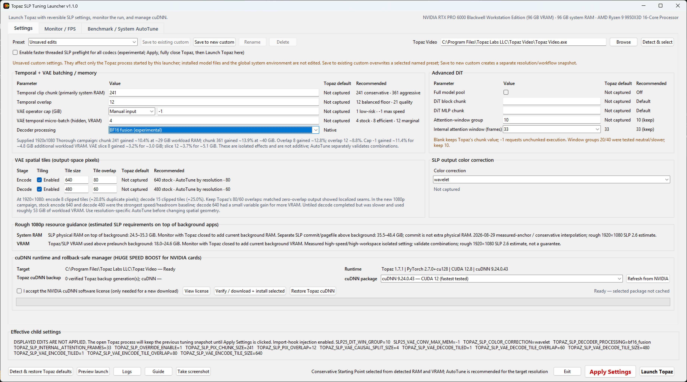
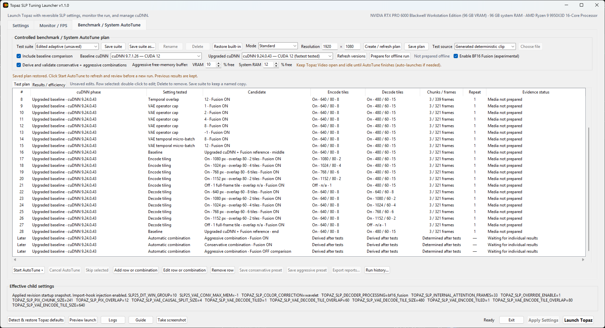
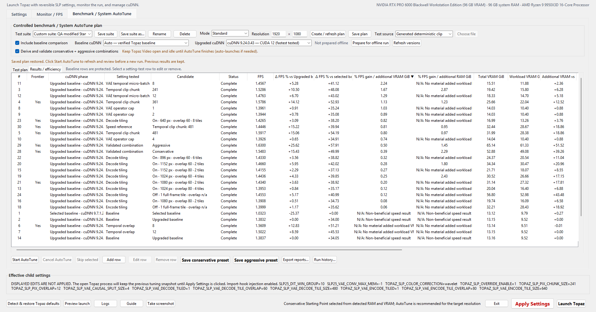
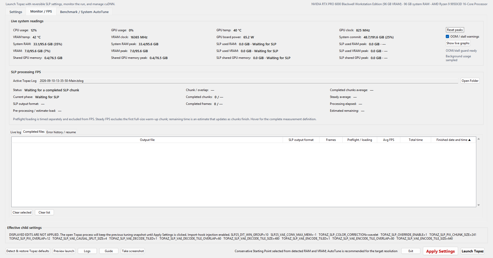
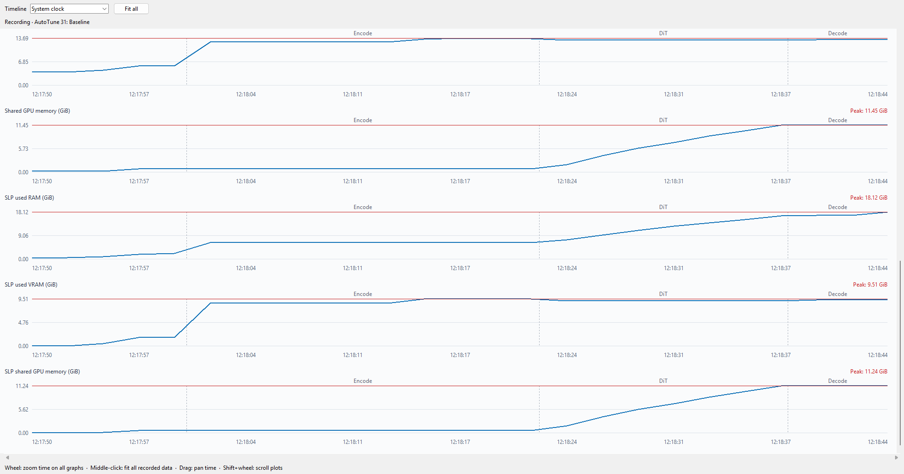
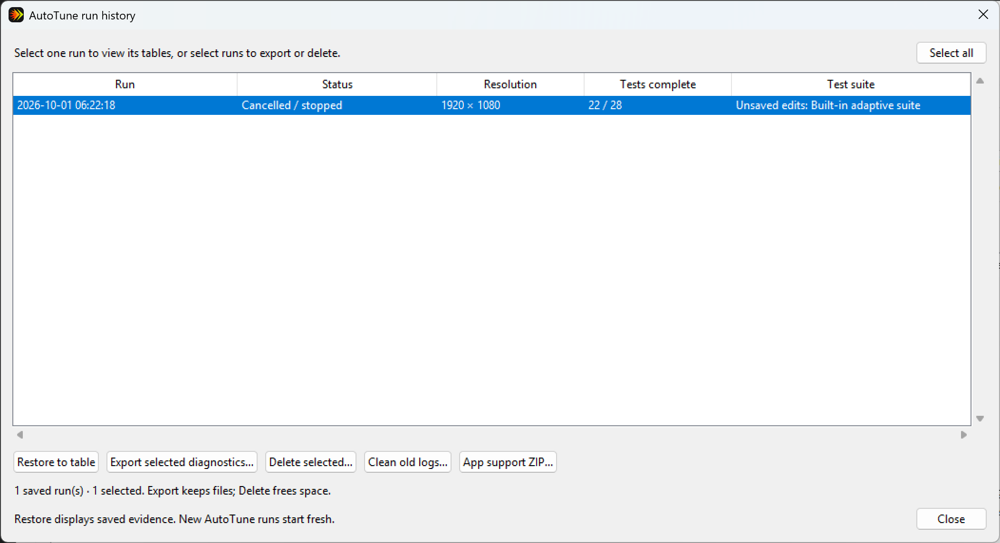
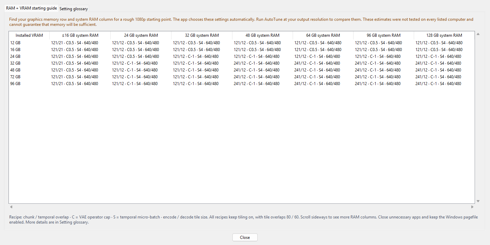

# Topaz SLP Tuning Launcher v1.0.3.4

Tune Topaz Video SLP 2.6, compare performance on your computer, and watch memory use while videos process—all from one portable Windows app.

[Download](https://github.com/skv89/Topaz-SLP-Launcher/releases/latest) · [Report a problem](https://github.com/skv89/Topaz-SLP-Launcher/issues)

## What is new in v1.0.3.4

- Test your own combinations using **Add row or combination** and **Edit row or combination**, with the familiar tuning controls.
- Use the arrow beside **Start AutoTune** to run selected tests with the required baseline comparisons. A previous full AutoTune run is not needed.
- Built-in adaptive plans choose tests up front using your hardware and selected output resolution. No preliminary calibration run or previous results are required.
- AutoTune checks the selected native and upgraded cuDNN runtimes before starting benchmark rows, so a startup failure is reported early and saved for troubleshooting.
- Support ZIPs include the upgraded cuDNN inventory and useful evidence from middle rows, with problem rows prioritized when limits are reached.
- New runs retain compact memory, temperature, clock and chunk-timing evidence using readings already collected by the app.
- AutoTune rejects unsupported saved test rows and preserves the original plan when you create a replacement.

## Getting started

1. Save **Topaz-SLP-Launcher.exe** in a writable folder and open it.
2. Detect & select the **Topaz Video** location.
3. Choose **Conservative Starting Point**, or **Stock Topaz** for no tuning overrides. Running Autotune is recommended.
4. Click **Launch Topaz**, then start an SLP export normally in Topaz.
5. Test a short duplicate clip at your intended output resolution before a long job.

The launcher now supports the new Topaz Video v1.7.1.2 Beta and likely all past versions and likely future versions. It handles its compatibility helper automatically if needed; Windows may ask for administrator approval. 

To update, choose **Exit** in the launcher or its tray menu, back up the old EXE, then replace it. Keep **Topaz-SLP-Launcher-Data** to retain settings, presets, reports and cuDNN backups.

Screenshots show the existing interface from earlier releases on one example computer, not recommended settings for every GPU.

## Find settings for your computer

Open **Benchmark / System AutoTune**, choose your output resolution and **Standard** mode, then click **Create / refresh plan**. The built-in adaptive suite uses your installed memory and selected output dimensions to generate its setting tests before the run. It does not require previous results or a preliminary benchmark. Saved custom suites keep your edits.

Add, edit or remove tests if desired and save your suite. Prepare the selected runtimes if prompted, then start AutoTune.

Leave Topaz open and idle, disconnect from the internet, keep the hardware running cool by leaving open windows, using AC, or running with an open case, and avoid using the computer during AutoTune as I found even light computer use such as typing documents or web browsing without videos can affect the performance significantly. Keep in mind individual-setting rows test a single parameter tweak, while custom-combination rows test all selected changes together. A result might differ by only a few percentage points; but if outside factors distorts the performance by a few percent, then the AutoTune results might not be reliable or useful. Saved tables remain available for reference; they do not resume processing.

### Test your own combination

Choose **Add row or combination**, select a combination and enter its settings. You can start from current, saved or previously tested settings. **Edit row or combination** changes an existing editable row. Hover over a combination row, or use its keyboard help, to see the full settings.

To compare just a few ideas, select those rows and choose **Run selected tests** from the arrow beside **Start AutoTune**. The launcher includes the required Topaz and upgraded-cuDNN baseline comparisons automatically. This works on the first run; you do not need to finish a full suite or delete other rows. The normal **Start AutoTune** action still runs the full plan.

Custom combinations use the same live memory safeguards. Their measured results are treated as complete combinations, not as separate gains to add to other settings. A user-selected combination is not automatically a validated preset recommendation.

### Runtime checks before AutoTune

After the selected runtimes are prepared, AutoTune checks that each runtime needed by the plan can load before preparing test media or starting timed rows. A comparison run checks native and upgraded cuDNN. The check does not render a video, change the installed DLLs, or add a delay when simply opening the launcher. Each runtime check has a 30-second deadline; loading time varies by computer.

If a runtime cannot start, AutoTune stops before the benchmark rows and saves the diagnostic results. Open **Run history…** and use **Export selected diagnostics…** for that run. A passed startup check confirms loading, not that every setting will fit in memory or process successfully.

With **Derive and validate conservative + aggressive combinations** enabled, AutoTune combines successfully tested settings and ranks the choices by predicted speed. Each choice must fit **both** the VRAM and system RAM buffers for its preset. Aggressive and conservative use their own limits. The isolated setting suite is not run again.

AutoTune validates up to **three aggressive combinations**, then up to **three conservative combinations**, trying the next eligible choice if needed. A successful conservative choice can also serve as the aggressive fallback. Only eligible tested results can be saved as recommendations. Hover over either Save preset button, or focus it and press **F1**, for the selection explanation and a table of the tested recommendation and up to two calculated alternatives. Calculated gains and memory totals are estimates; the alternatives are for information and are not saved by those buttons. The help identifies the capacities and buffers recorded for that run and flags differences from current hardware or edited inputs. It shows the winner's measured memory peaks separately from estimates. Older results are not recalculated when the inputs change.

The aggressive buffer fields accept decimal percentages from **0% up to the conservative buffer**. Press Enter or leave the field to commit an edit: a number above the limit becomes the limit, and a negative number becomes zero. Blank or nonnumeric entries return to the last valid value.

| Installed capacity | Recommended aggressive VRAM free | Conservative VRAM free | Recommended aggressive RAM free | Conservative RAM free |
|---|---:|---:|---:|---:|
| 16 GB and below | 7% | 15% | 12% | 20% |
| 24 GB | 7% | 15% | 12% | 20% |
| 32 GB | 7% | 15% | 12% | 25% |
| Above 32 GB | 10% | 20% | 12% | 30% |

VRAM and system RAM use their **own installed capacities** to select a row. Percentages reserve space from total memory, including Windows, Topaz and other applications. A real Topaz export can use more memory than the idle Topaz interface used during AutoTune; leave a larger buffer if needed. Lower buffers increase out-of-memory risk. Changing these fields affects new plans, not older saved results.

Candidate tests that stop reporting render progress are stopped automatically after at least **20 minutes**, with a longer allowance when successful baseline timing warrants it. Overall test deadlines remain finite. Baseline and model-loading phases have separate safeguards.

When a test reaches a memory safety limit, AutoTune stops that test and checks that its worker has closed and memory has recovered before advancing. An optional Topaz comparison may be skipped after recovery; comparisons with that missing baseline are then unavailable. The **upgraded baseline** is required to compare setting changes, so AutoTune stops if that reference cannot finish. Persistent memory pressure, missing required GPU readings, or unverified cleanup also stop the run and preserve completed results. Lowering a preset's free-memory buffer does not disable these safeguards.

AutoTune reuses a recent, comparable upgraded baseline after some brief memory failures, while retaining fresh comparison runs when conditions require them. On eligible high-resolution systems, the adaptive plan can add a modest **161-frame chunk** test even when its initial memory estimate excludes larger chunks. That row still has to pass the same memory safeguards.

Combination recommendations include an allowance for background memory use. If a tested combination uses more memory than predicted, that measurement can tighten the estimates for the remaining comparable choices. Aggressive and conservative still use their own VRAM and system RAM limits.

Review **Results / efficiency**, save a validated preset, or use **Export reports…** for the PDF and result files. “Aggressive” is a speed-oriented choice, not a guarantee of the fastest possible settings. Use **Thorough** to check close or surprising results.

Example results from an earlier release. Performance varies by computer, video and resolution.

## Monitor your videos

**Monitor / FPS** shows CPU/GPU activity, temperatures, power and memory, plus processing progress and completed files.

Live readings update automatically every **five seconds**, including VRAM temperature where supported. **Reset peaks**, **OOM / stall warnings** and **Show live graphs** sit beside the readings. “Background usage sampled” means the launcher recorded memory use while SLP was idle, so it can estimate the extra memory used by SLP.

Ordinary low-VRAM warnings use a remaining-memory threshold of **0.8 GiB on 16-GB cards** and **1 GiB on 24-GB cards**. Uncheck **OOM / stall warnings** to disable those launcher popups; the preference is saved immediately. AutoTune's automatic safeguards remain active.

**Completed chunks average** includes all finished chunks. **Steady average** excludes the first full-size warm-up chunk and a short final chunk. Neither includes pre-processing/loading.

Click **Show live graphs** to compare readings. The mouse wheel zooms time on all graphs together; middle-click fits the full timeline. Use the scrollbar or **Shift+wheel** to scroll through the plots. Memory peaks are marked in red, and phase labels appear when there is room to read them.

Graphs reuse the existing monitor readings. Each new SLP file replaces the previous graph history instead of accumulating graph files on disk.

## Share a problem or free disk space

Open **Run history…**:

- **Export selected diagnostics…**: select the AutoTune runs you need help with. The ZIP includes runtime startup outcomes, native and upgraded cuDNN inventory metadata, test results, per-row logs and the launcher's recent log. New runs also retain compact resource history and separate first-chunk/later-chunk timings. All rows are considered; failed, warning-bearing and unusually slow rows receive priority within the archive limits. The manifest identifies missing, truncated or omitted files. Older runs cannot supply measurements that were never recorded.
- **App support ZIP…**: use this for a general launcher problem—for example, an error when opening Topaz. No run selection is needed.
- **Delete selected…**: remove selected saved runs after reviewing the size and confirming.
- **Clean old logs…**: remove eligible older logs while keeping results, reports and failed-run evidence.

Exporting does not upload or delete anything. Diagnostic ZIPs are not full report backups; review them for private information before sharing. Deleting a run keeps original videos, presets and reports exported outside that run's folder.

## Help and requirements

Use **Ctrl+Z** to undo tuning parameter edits or AutoTune row edits/deletions. Hover over controls and dropdown options for explanations. **Guide** provides starting-point guidance and a setting glossary. The separate **Error history / resume** page for ordinary Topaz exports can reopen a failed source from the beginning; you confirm its export in Topaz. It does not resume an AutoTune campaign.

Requires **Windows x64**, a supported **Topaz Video installation with SLP 2.6**, and an **NVIDIA CUDA GPU**. No Python installation is needed. AutoTune and optional faster preflight require both FFmpeg and FFprobe; the selected Topaz installation should already provide them. You can also place **ffmpeg.exe** and **ffprobe.exe** together beside the launcher EXE (or in its **bin**, **ffmpeg**, or **ffmpeg/bin** subfolder). No system settings need to be changed. New cuDNN downloads require accepting NVIDIA's license.

**Important:** tuning is experimental. Settings that fit a 96-GB workstation may not fit a 16-GB GPU/32-GB RAM computer. Larger chunks, tiles and batches—or an uncapped VAE—can greatly increase memory use. Safety guards cannot prevent every OOM or driver failure. 

The app is unsigned, so Windows may show an unknown-publisher warning. Download only from this repository. This independent community tool is not endorsed by Topaz Labs or NVIDIA.

[License](LICENSE)
